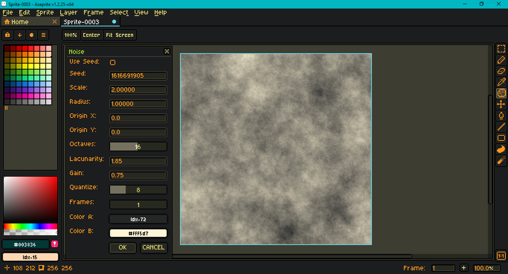
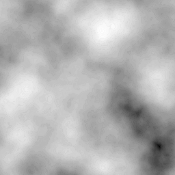
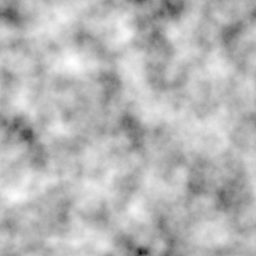

# AsepriteOpenSimplex

This is a port of [KdotJPG](https://github.com/KdotJPG)'s [OpenSimplex 2](https://github.com/KdotJPG/OpenSimplex2) from Java to Lua. It preserves the public domain license of the source repository. (The source has subsequently updated its license from the Unlicense to CC0.)

It is intended for use with [Aseprite](https://www.aseprite.org/), an "animated sprite editor and pixel art tool." This script was created and tested with Aseprite version 1.3.2.

In addition to the port, there is an Aseprite dialog script which utilizes the technique developed by Etienne Jacob, a.k.a. [necessarydisorder](https://necessarydisorder.wordpress.com), in this [tutorial](https://necessarydisorder.wordpress.com/2017/11/15/drawing-from-noise-and-then-making-animated-loopy-gifs-from-there/) to create looping animations with noise.

To use Open Simplex, open Aseprite and go to `File > Scripts > Open Scripts Folder`. Place both `.lua` files from this repository in that folder. Then go to `File > Scripts > Rescan Scripts Folder`. Both scripts should now appear in the `File > Scripts` sub-menu. Selecting the dialog script should open a dialog.

If an error message in Aseprite's console appears, check if the script folder is on a file path that includes characters beyond [UTF-8](https://en.wikipedia.org/wiki/UTF-8), such as 'é' (e acute) or 'ö' (o umlaut). See this [thread](https://community.aseprite.org/t/script-folder-path-cannot-open-no-such-file-or-directory/16818) for discussion of the issue on the community forum.

To modify these scripts, see Aseprite's [API Reference](https://github.com/aseprite/api). A [type definition](https://github.com/behreajj/aseprite-type-definition) for use with VS Code and the [Lua Language Server extension](https://github.com/LuaLS/lua-language-server) is also available.

This dialog contains the following inputs:

 - Use Seed - Use a fixed seed rather than a randomly generated one.
 - Seed - The fixed seed to use if the above is checked.
 - Scale - Multiplied with the pixel x and y to scale the noise.
 - Radius - Multiplied with the noise's periodic component - the frame for animated noise.
 - Origin - noise input translation.
 - Octaves - Number of for loop iterations to refine the noise.
 - Lacunarity - Multiplied with frequency per loop ieration.
 - Gain - Multiplied with amplitude per loop iteration.
 - Quantize - Reduces granularity of factor returned by noise.
 - Size - Sprite width and height.
 - Frames - Number of frames to create.
 - FPS - Converted to frame duration.
 - Colors - Colors to mix by noise factor.

Color is mixed in linear sRGB. To make a smooth animation with fewer frames, reduce the radius. To make the noise gradient discrete, increase the quantization (but keep at a low number). Tiled noise stretches its aspect ratio with the sprite size. An animated .gif generated by this script looks like this:

A tileable .png looks like this:

`OpenSimplex2S` specifically has been ported due to Lua's use of 64 bit numbers. This is a fairly direct port; I don't know enough about Lua to optimize the algorithm for the language. Four dimensional noise is required to create a looping animation. It may take the script a few seconds to generate all the frames, particularly with a high number of octaves.