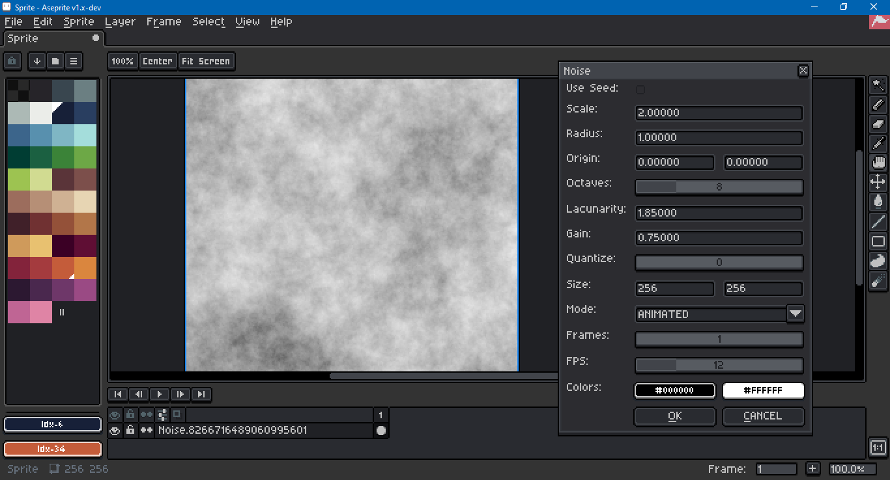

# AsepriteOpenSimplex

This is a port of [KdotJPG](https://github.com/KdotJPG)'s [OpenSimplex 2](https://github.com/KdotJPG/OpenSimplex2) from Java to Lua. It preserves the public domain license of the original.

It is intended for use with [Aseprite](https://www.aseprite.org/), an "animated sprite editor and pixel art tool." This script was created and tested with Aseprite version 1.2.25 .

In addition to the port, there is an Aseprite dialog script which utilizes the technique developed by Etienne Jacob, a.k.a. [necessarydisorder](https://necessarydisorder.wordpress.com), in this [tutorial](https://necessarydisorder.wordpress.com/2017/11/15/drawing-from-noise-and-then-making-animated-loopy-gifs-from-there/) to create looping animations with noise.

If you wish to adapt these scripts and need a reference on what's possible, Aseprite's scripting API can be found [here](https://github.com/aseprite/api).

To use Open Simplex, open Aseprite and go to `File > Scripts > Open Scripts Folder`. Place both `.lua` files from this repository in that folder. Then go to `File > Scripts > Rescan Scripts Folder`. Both scripts should now appear in the `File > Scripts` sub-menu. Selecting the dialog script should open a dialog.

This dialog contains the following inputs:

 - Use Seed - Use a fixed seed rather than a randomly generated one.
 - Seed - The fixed seed to use if the above is checked.
 - Scale - Multiplied with the pixel x and y to scale the noise.
 - Radius - Multiplied with the angle per frame of animation.
 - Origin X - pixel x translation.
 - Origin Y - pixel y translation.
 - Octaves - Number of for loop iterations to refine the noise.
 - Lacunarity - Multiplied with frequency per loop ieration.
 - Gain - Multiplied with amplitude per loop iteration.
 - Quantize - Reduces granularity of factor returned by noise.
 - Frames - Number of frames to create.
 - Color B - Lower bound color.
 - Color A - Upper bound color.

Color is mixed in RGB. Images are assumed to use RGB Color Mode, not Grayscale or Indexed color. To make a smooth animation with fewer frames, reduce the radius. To make the noise gradient less smooth, more appropriate for pixel art, increase the quantization (but keep at a low number). An animated .gif generated by this script looks like this:

`OpenSimplex2S` specifically has been ported due to Lua's use of 64 bit numbers. This is a fairly direct port; I don't know enough about Lua to optimize the algorithm for the language. Four dimensional noise is required to create a looping animation. It may take the script a few seconds to generate all the frames, particularly with a high number of octaves.